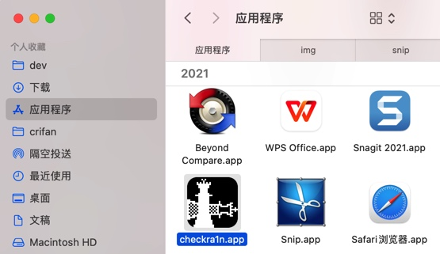
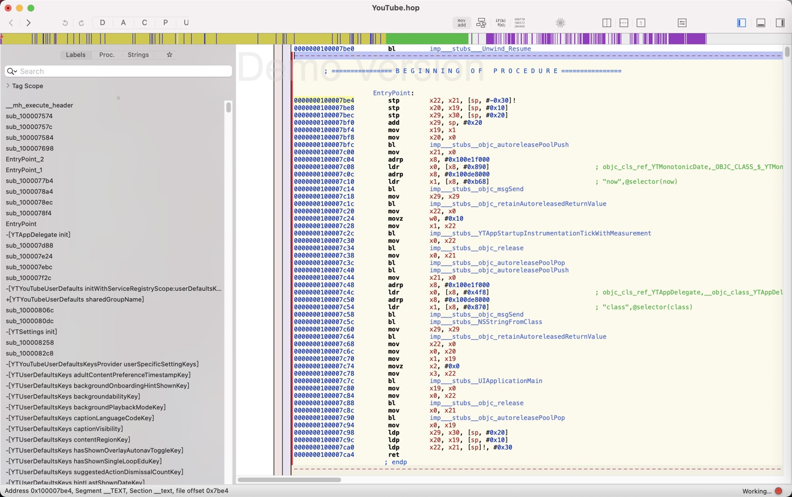

# iOS逆向内容概述

* 先准备越狱iPhone
  * 越狱工具
    * `unc0ver`
      * 自己下载unc0ver到iPhone中
        * 
      * 运行unc0ver去越狱
    * `checkra1n`
      * Mac中运行checkra1n，根据操作提示去越狱
        * 
    * 也可以借助于`爱思助手`的`一键越狱`去越狱
      * 底层也是用unc0ver、checkra1n等工具
      * 
  * 包括准备好常用越狱插件开发工具，比如
    * `Filza`：文件管理
    * `OpenSSH`：ssh连接操作iPhone
    * `AFC2`：允许通过USB操作iPhone
    * `iCleaner Pro`：临时禁止或启用插件
    * `AppSync Unified`：免签名安装app
    * 等等
* 再从AppStore安装的正版app中**砸壳**出ipa
  * 
  * 常用工具
    * `frida-ios-dump`
      * 
    * `Clutch`
    * `dumpdecrypted`
    * `bfinject`
* 接着才是逆向开发
  * 主要分两类
    * 静态分析
    * 动态调试
  * 下面分别详细解释：
* 静态分析
  * 从脱壳ipa解压得到app包
    * 用class-dump导出头文件
      * 
      * 以搞懂包含哪些类
    * 查看二进制信息
      * `MachOView`
        * 
      * `jtool2`
      * `rabin2`
    * 导出字符串等资源
      * `strings`
        * 
      * `nm`
      * `otool`
      * `jtool2`
      * `rabin2`
    * 分析代码逻辑
      * IDA：Functions、Strings、Imports、F5伪代码等好用的功能模块
        * 
      * Hopper
        * 
* 动态调试
  * 用各种调试方式和工具去调试app的逻辑
    * 常用调试方式
      * 图形界面：`XCode`+`MonkeyDev`
        * 
        * XCode内部也有`lldb`
      * 命令行：`debugserver`+`lldb`
        * 
    * 常用逆向工具
      * `Frida`：hook对应函数，调试输入参数和返回值
        * 
      * `Cycript`：查看页面元素的类和属性、实时修改各种值
        * 
      * `Reveal`：查看UI页面详细属性
        * 
  * 目的：搞懂我们所关心的app内部相关逻辑
    * 用于后续去写hook代码去修改成我们要的逻辑和值
* 最后才是：Tweak插件开发
  * 常见插件开发框架
    * 基于`CydiaSubstrate`
      * `Theos`/`Logos`
    * `fishhook`
    * `CaptainHook`
  * 具体开发方式
    * 命令行
      * `Theos`/`Logos`：写hook源码.xm，基于Makefile去编译
        * 
    * 图形界面
      * `iOSOpenDev`：把Logos等开发集成进了XCode
        * 支持Logos、CaptainHook等
        * 
      * `MonkeyDev`：iOSOpenDev的改进版
        * 支持Logos、CaptainHook等
        * 
        * 
  * 去开发插件=写hook代码
    * 前提：通过静态分析的头文件和动态调试，已知的app内部的类的属性和函数
    * 核心逻辑：去hook对应类的函数和属性
      * 实现对应的效果，比如：
        * 调试：输出函数的输入参数和输出结果
        * 修改逻辑：屏蔽原先逻辑，重写自己想要的逻辑
  * 开发出的插件常用于
    * 逆向破解特定app
      * 绕过ssl证书校验，实现Charles抓包https可看到明文数据
      * 修改app原有逻辑，实现特定的功能
        * 支付宝：修改显示的余额
        * 微信：抢红包
        * 抖音：点赞关注
    * 反反调试
    * 反越狱检测
