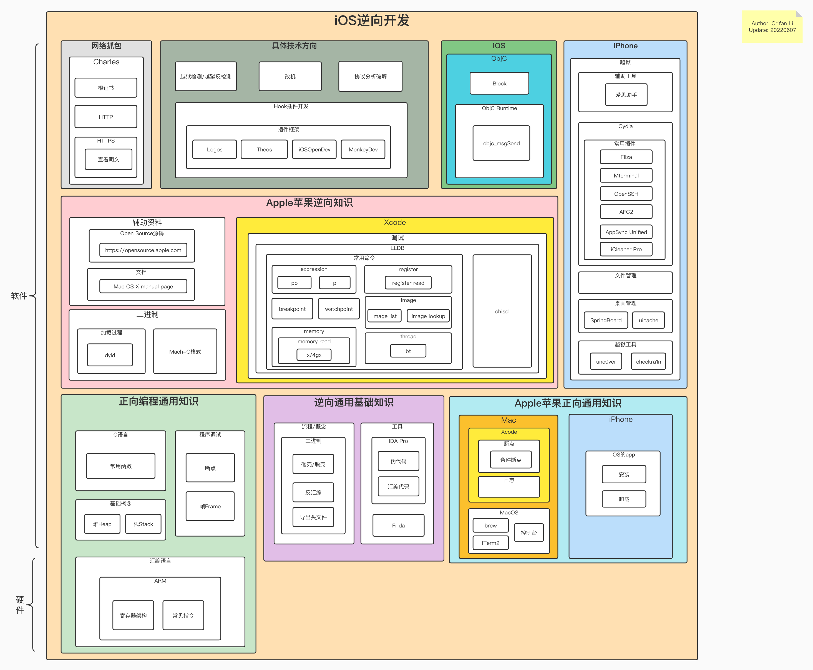

# iOS逆向领域架构图

为了能对iOS逆向有个更全面和直观的了解，此处把iOS逆向开发所包含的各个领域的内容以及相互关系，整合到一张图：

iOS逆向领域架构图

* 在线浏览（支持缩放）
  * [iOS逆向开发内容架构图 | ProcessOn免费在线作图](https://www.processon.com/view/link/629ea9847d9c081ef425b111)
* 离线查看
  * 
